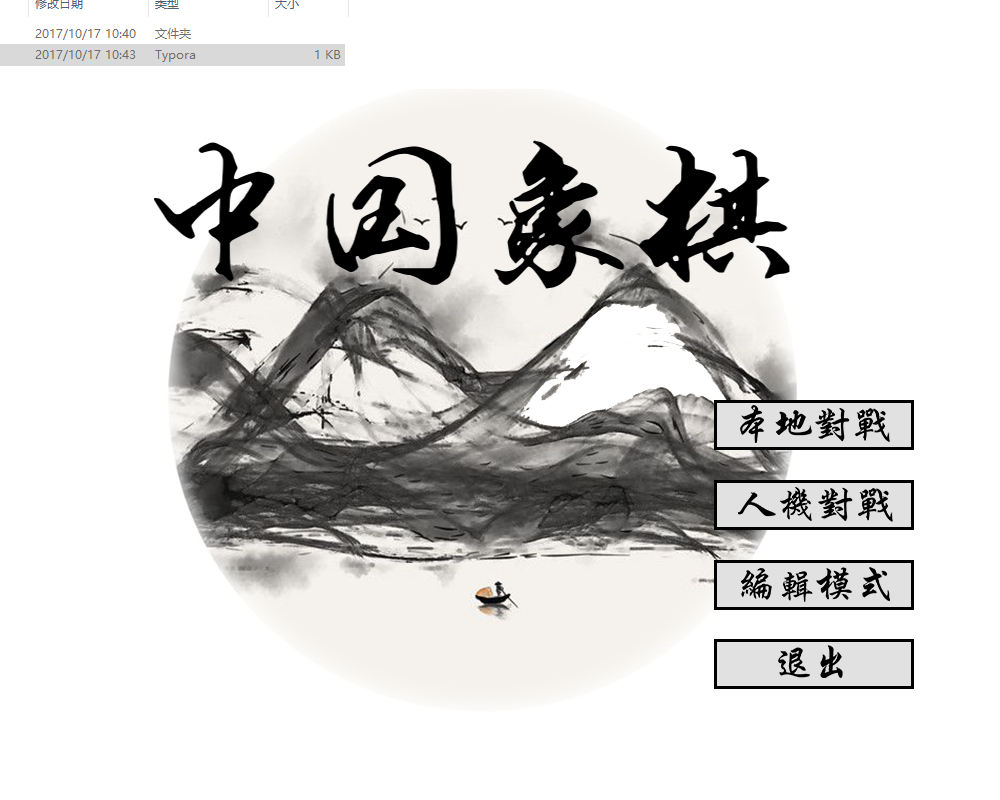
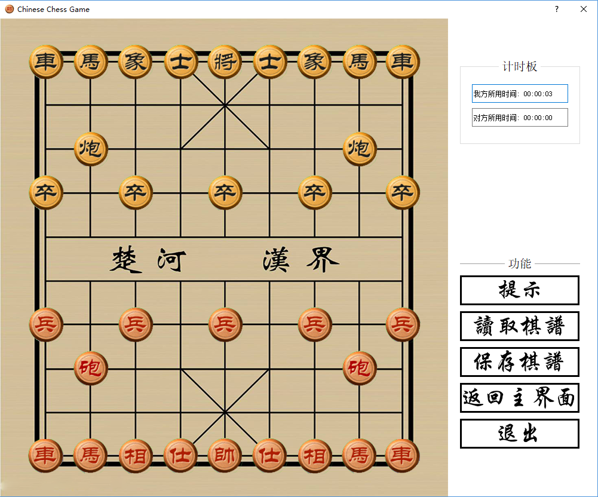
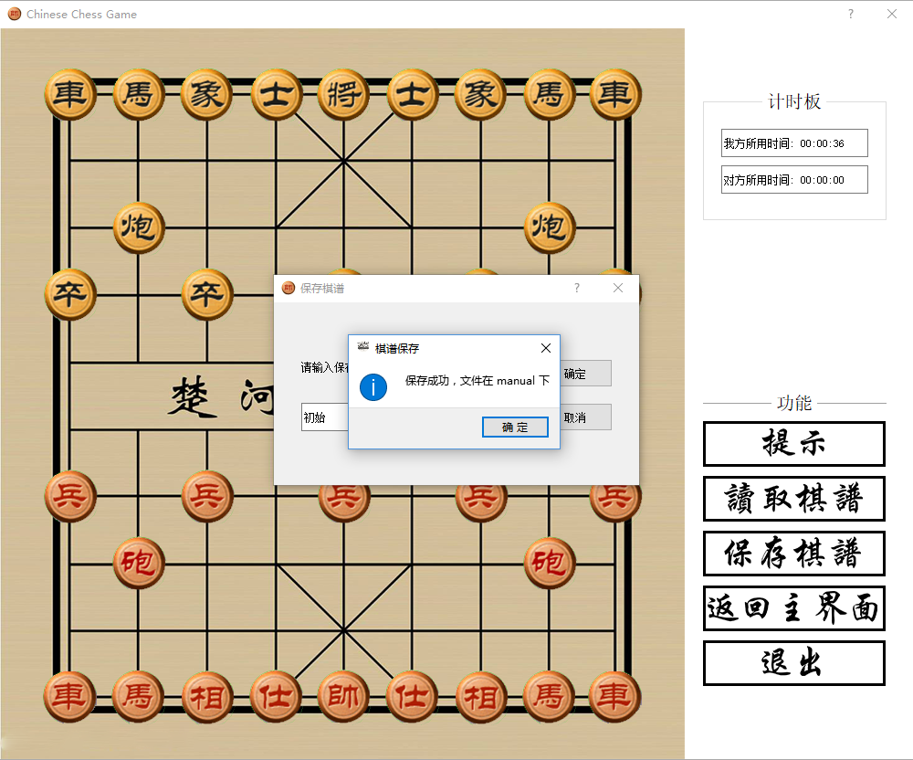
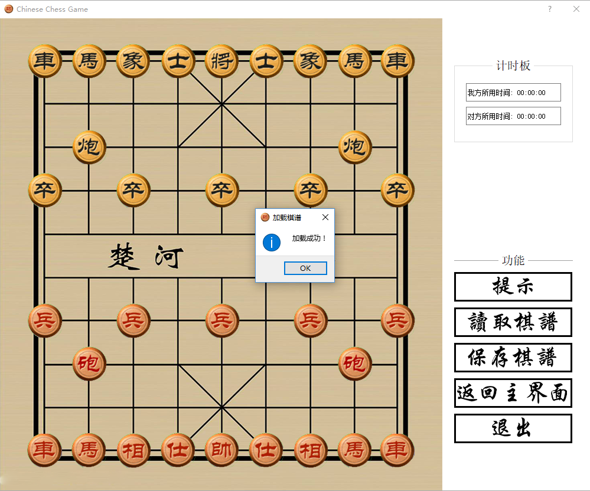
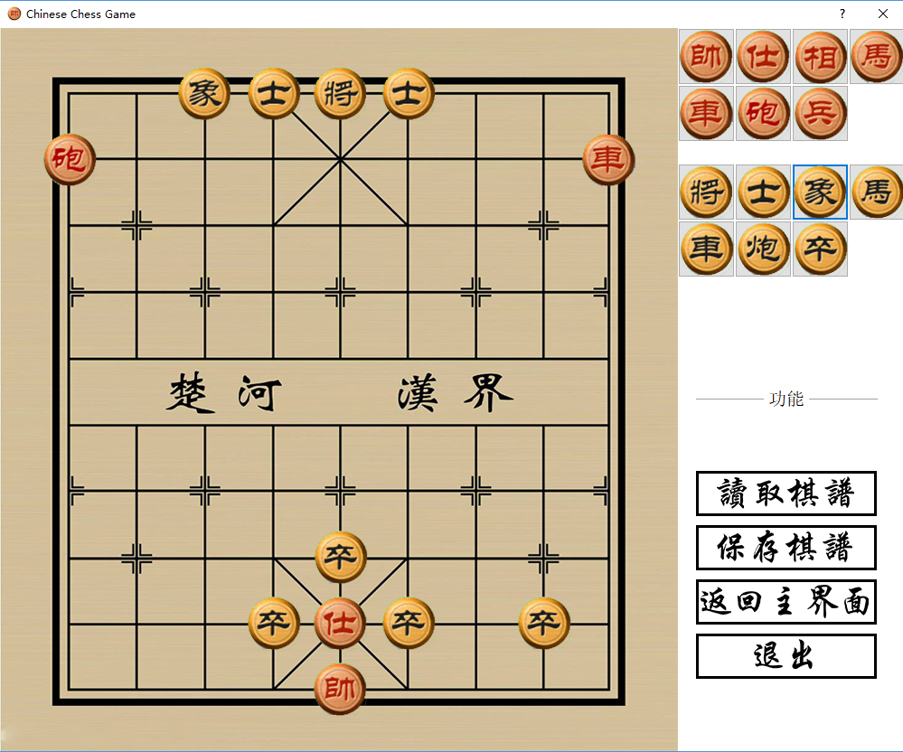

# Chinese Chess 

Qt 5.8 + MSVC 2013

[Release](https://github.com/PatrickLin1993/ChineseChess/releases)

## 程序截图

1. 开始界面

2. 主界面

   

3. 保存棋谱

   

4. 读取棋谱

   

5. 编辑棋谱

   

###  待完成:

1. 网络部分
2. 优化代码
3. 编辑模式条件检测
4. 棋盘反转
5. AI 加入开局库

